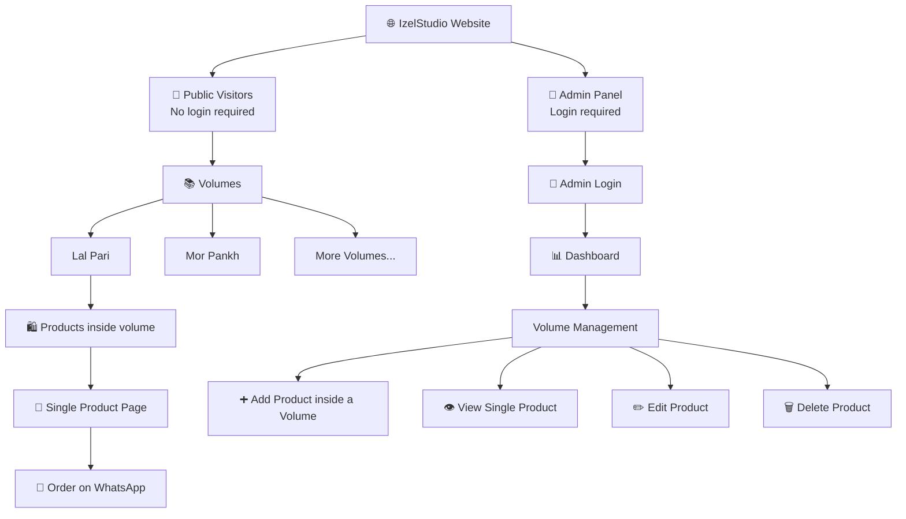
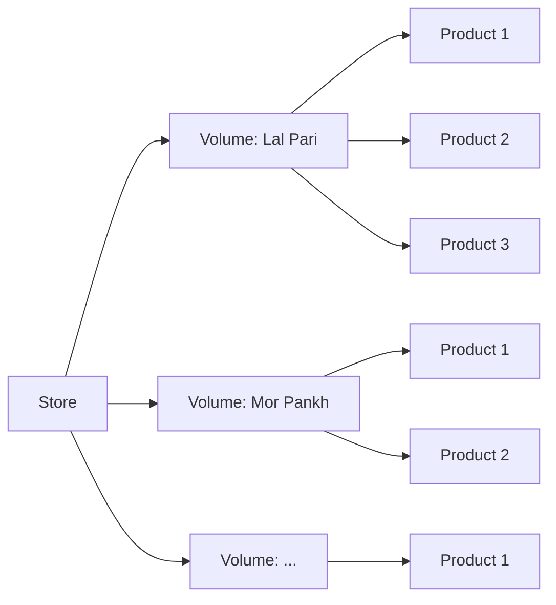
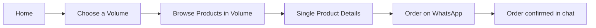
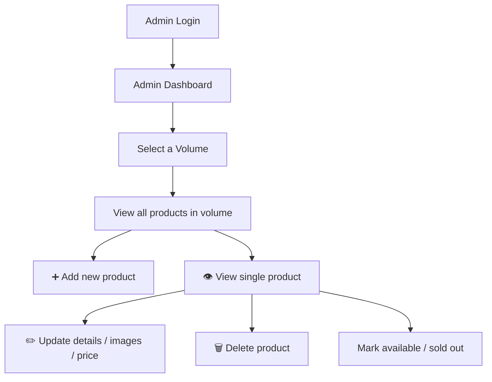

# 🛍️ IzelStudio.Store

> A product showcase website built with the MERN stack. Customers browse products by volume and order directly on WhatsApp. Products are managed through a secure admin dashboard.

[](https://www.mongodb.com/)
[](https://expressjs.com/)
[](https://reactjs.org/)
[](https://nodejs.org/)

---

## 🌟 Overview

**[IzelStudio](https://www.izelstudio.store/)** is a lightweight, budget-friendly showcase website built with the MERN stack (MongoDB, Express.js, React, Node.js).

The website is used **only to showcase products**, organized into different **volumes** (collections) such as *Lal Pari*, *Mor Pankh*, and more. There is no cart, checkout, or customer account system. When a customer likes a product, they tap **Order on WhatsApp** and complete the purchase directly with the store owner in chat.

Only the **admin panel** is protected by authentication. Normal visitors can browse the entire site without signing up or logging in.

---

## ⏳ Hosting Note (Render Free Tier)

The backend is hosted on **Render's free tier**. Free instances go to sleep after a period of inactivity, so:

- The **first request after a while can take 30-60 seconds or more** to load while the server wakes up.
- Once it is awake, the website works at normal speed.
- If products do not appear right away, please wait a moment and refresh the page.

This is a limitation of the free hosting plan, not a bug in the application.

---

## 🔄 How It Works

1. A visitor opens the website and browses products by volume (Lal Pari, Mor Pankh, etc.).
2. They open a volume to see all the products inside it.
3. They open a single product to see its images, details, and price.
4. They tap **Order on WhatsApp**, which opens a chat with the store and a pre-filled message containing the product name, volume, and link.
5. The order is confirmed and handled over WhatsApp.
6. The admin logs in to the dashboard to manage volumes and the products inside them.

---

## 🏗️ Website Architecture

### Overall Structure



### Volumes and Products

Each volume is a collection that contains its own products. Admins add products inside a specific volume.



### Visitor Journey



### Admin Product Management



---

## ✨ Features

### 🛒 Public Website (No Login Required)
- Browse products by **volume** (Lal Pari, Mor Pankh, etc.)
- Product detail pages with images, description, and price
- Search and filter products
- **Order on WhatsApp** button with a pre-filled message per product
- No signup, no cart, no checkout

### 🔧 Admin Panel (Login Required)
- Secure admin login (JWT authentication)
- Volume management (add, rename, reorder, remove volumes)
- Add products inside a volume
- View a single product and manage it (update or delete)
- Image upload for products
- Mark products as available or sold out
- Dashboard overview of products and volumes

### 🎨 Design
- Clean, responsive UI
- Mobile-first design
- Modern color scheme
- Smooth animations

---

## 🛠️ Tech Stack

### Frontend
| Technology | Purpose |
|------------|---------|
| React 18+ | UI framework |
| React Router | Navigation |
| Axios | API calls |
| Tailwind | Styling |

### Backend
| Technology | Purpose |
|------------|---------|
| Node.js | Runtime environment |
| Express.js | Web framework |
| MongoDB | Database |
| Mongoose | ODM for MongoDB |
| JWT | Admin authentication |
| Bcrypt | Admin password hashing |

### Integrations
| Technology | Purpose |
|------------|---------|
| WhatsApp click-to-chat (`wa.me`) | Customer orders via pre-filled chat message |

---

## 🔐 Access Control

| Area | Authentication |
|------|----------------|
| Home, volumes, product pages | ❌ Not required |
| Order on WhatsApp | ❌ Not required |
| Admin dashboard and product/volume management | ✅ Required (admin only) |

---

## 🚀 Getting Started

```bash
# 1. Clone the repository
git clone https://github.com/your-username/izelstudio.git
cd izelstudio

# 2. Install dependencies
cd server && npm install
cd ../client && npm install

# 3. Run the backend
cd server && npm run dev

# 4. Run the frontend
cd client && npm run dev
```

---

## 💬 WhatsApp Order Link

Each product's order button builds a link like this:

```js
const message = `Hi! I'd like to order:
Product: ${product.name}
Volume: ${product.volume.name}
Link: ${window.location.href}`;

const url = `https://wa.me/${WHATSAPP_NUMBER}?text=${encodeURIComponent(message)}`;
```

---

## 📄 License

This project is licensed under the MIT License.
